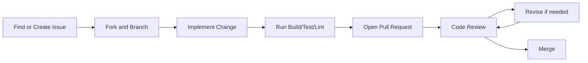

# Contributing to VaultX

Thanks for investing your time in VaultX.  
This guide explains how to contribute effectively, safely, and in a reviewer-friendly way.

---

## Table of Contents

- [Project Values](#project-values)
- [Contribution Workflow](#contribution-workflow)
- [Visual Workflow Diagram](#visual-workflow-diagram)
- [Issue Guidelines](#issue-guidelines)
- [Development Setup](#development-setup)
- [Branching Strategy](#branching-strategy)
- [Commit Standards](#commit-standards)
- [Pull Request Checklist](#pull-request-checklist)
- [Code Quality Expectations](#code-quality-expectations)
- [Security Requirements](#security-requirements)
- [Documentation Requirements](#documentation-requirements)
- [Testing Policy](#testing-policy)
- [Review and Merge Process](#review-and-merge-process)
- [Good First Contributions](#good-first-contributions)
- [Code of Conduct](#code-of-conduct)

---

## Project Values

VaultX contributions should optimize for:

1. **Security first** (especially around auth, encryption, and storage)
2. **Clarity** (easy to read and review)
3. **Reliability** (tested and reproducible)
4. **Beginner-friendliness** (new contributors can follow your work)

---

## Contribution Workflow

1. Check open issues and discussions first.
2. For significant changes, open an issue before coding.
3. Fork repo and create a focused branch.
4. Implement change with tests/docs updates.
5. Run local checks.
6. Open PR with clear context and evidence.
7. Address review feedback quickly and clearly.

---

## Visual Workflow Diagram



---

## Issue Guidelines

When creating an issue:

- Use a clear title
- Explain expected vs actual behavior
- Add reproduction steps
- Share environment details (Android version, emulator/device)
- Include screenshots/log snippets when relevant

For feature requests:

- Explain the problem first, then proposed solution
- Mention trade-offs and alternatives if possible

---

## Development Setup

1. Fork and clone repository.
2. Open in Android Studio.
3. Add local Firebase config: `app/google-services.json`.
4. Sync Gradle.
5. Validate setup:
   - `./gradlew.bat :app:assembleDebug`

If your contribution touches Firestore behavior, verify rules/index deployment in your test project.

---

## Branching Strategy

- Base branch: `main`
- Keep one logical change per branch
- Recommended names:
  - `feat/<short-topic>`
  - `fix/<short-topic>`
  - `refactor/<short-topic>`
  - `docs/<short-topic>`
  - `test/<short-topic>`

Examples:

- `feat/password-strength-meter`
- `fix/google-auth-cancel-state`
- `docs/newbie-install-guide`

---

## Commit Standards

Use conventional-style intent prefixes:

- `feat:` new functionality
- `fix:` bug fix
- `docs:` documentation updates
- `refactor:` non-functional code cleanup
- `test:` test additions/updates
- `chore:` tooling/build/meta tasks

Examples:

- `feat: add secure clipboard timeout preference`
- `fix: block empty password save in edit flow`
- `docs: expand README architecture section`

Keep commits small and explain **why** in the body when needed.

---

## Pull Request Checklist

Your PR should include:

- Clear summary of problem and solution
- Scope boundaries (what is included/not included)
- Screenshots/video for UI changes
- Testing evidence
- Security impact analysis if relevant
- Confirmation that sensitive clipboard, biometric lock, logging, and screenshot behavior were considered when relevant
- Rollback notes for risky changes

Use this mini template:

```text
## What
## Why
## How
## Test plan
## Risks
## Follow-ups
```

---

## Code Quality Expectations

- Write Kotlin that is explicit and null-safe
- Keep Fragments thin; push logic to ViewModel/Repository
- Reuse existing `Resource` state pattern
- Avoid duplicate utility logic
- Use centralized helpers such as `ClipboardSecurity` for sensitive clipboard writes
- Prefer composable functions over large monolith methods
- Remove dead code and stale TODOs when touching related areas

---

## Security Requirements

Security is mandatory in this project.  
Any PR touching auth, crypto, persistence, or cloud access gets stricter review.

### Never commit

- `app/google-services.json`
- `google-services.json`
- `local.properties`
- `keystore.properties`
- `*.jks`, `*.keystore`, `*.p12`
- tokens, private keys, secret env files

### Never do

- Log plaintext passwords or tokens
- Log Firebase UIDs, ID tokens, auth tokens, decrypted passwords, or full exception traces from sensitive auth flows
- Store raw password values in Firestore
- Copy passwords directly with `ClipboardManager`; use `ClipboardSecurity.copySensitiveText`
- Generate passwords with non-cryptographic randomness
- Remove `FLAG_SECURE` from sensitive vault screens without a documented product/security reason
- Bypass biometric checks on cold launch or resume when biometric lock is enabled
- Loosen Firestore rules without justification + tests
- Disable security checks for convenience

### If touching encryption/auth

- Explain threat impact in PR
- Add or update tests
- Keep changes scoped and reviewer-friendly

### If touching password generation or clipboard behavior

- Use `java.security.SecureRandom` for password generation
- Keep generated passwords compatible with the existing length and character-class controls
- Route password copy actions through `ClipboardSecurity`
- Preserve the timeout-based clipboard clear unless replacing it with a safer approach

---

## Documentation Requirements

Update docs when behavior changes:

- `README.md` for user-facing behavior/setup
- `FIREBASE_SETUP.md` for config changes
- `FIRESTORE_SCHEMA.md` for model/schema changes
- `CONTRIBUTING.md` for process updates

If docs are not updated, mention why in PR.

---

## Testing Policy

Before opening a PR, run as many as applicable:

- `./gradlew.bat :app:assembleDebug`
- `./gradlew.bat test`
- `./gradlew.bat :app:lintDebug`
- `./gradlew.bat connectedAndroidTest` (if device/emulator available)

In PR description:

- list commands executed
- mention pass/fail status
- include rationale for skipped tests

---

## Review and Merge Process

1. Maintainers review for correctness, design, and security.
2. You address comments with focused follow-up commits.
3. Once approved and checks pass, PR is merged.
4. Squash/rebase strategy depends on maintainer preference.

---

## Good First Contributions

If you are new, start with:

- improving error messages and validation text
- README screenshots and onboarding docs
- unit tests for ViewModels/repositories
- minor UI consistency fixes
- small accessibility improvements (content descriptions, contrast checks)

---

## Code of Conduct

- Be respectful in technical discussions
- Critique code, not people
- Keep feedback specific and constructive
- Help newcomers ramp up

Thanks for contributing to VaultX and helping make secure software more accessible.
