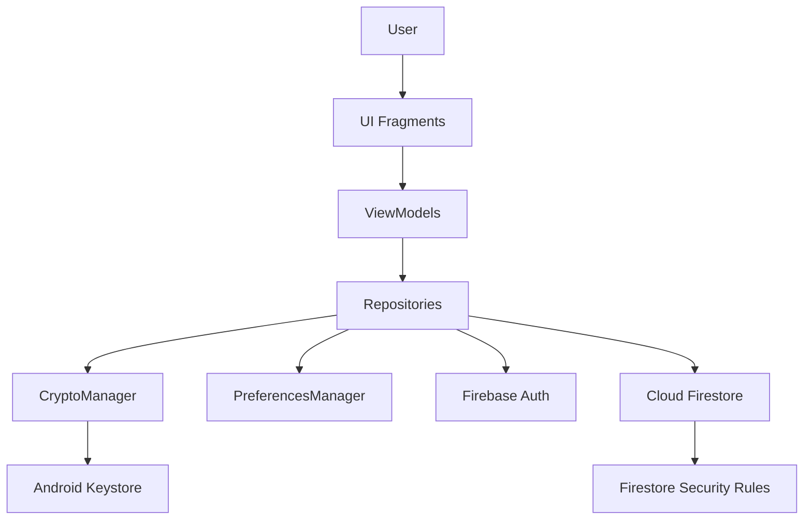
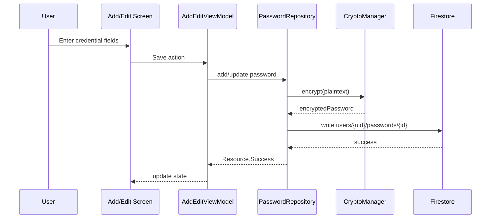
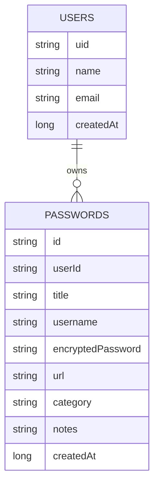

# VaultX

> A modern Android password vault with local-first encryption, biometric protection, and Firebase-powered sync.

VaultX helps users store credentials safely.  
Before any credential is sent to cloud storage, it is encrypted on-device using Android Keystore + AES-256-GCM.  
This means your app treats security as a **core feature**, not an afterthought.

---

## Table of Contents

- [Why VaultX Exists](#why-vaultx-exists)
- [Who Is This Project For](#who-is-this-project-for)
- [Core Features](#core-features)
- [How VaultX Works (Beginner Friendly)](#how-vaultx-works-beginner-friendly)
- [Architecture Diagram](#architecture-diagram)
- [Data Flow Diagram](#data-flow-diagram)
- [Project Structure](#project-structure)
- [Security Model](#security-model)
- [Firestore Data Model](#firestore-data-model)
- [Tech Stack](#tech-stack)
- [Getting Started](#getting-started)
- [Run, Build, and Test](#run-build-and-test)
- [Configuration and Firebase Setup](#configuration-and-firebase-setup)
- [Troubleshooting](#troubleshooting)
- [Roadmap](#roadmap)
- [Contributing](#contributing)
- [License](#license)
- [Disclaimer](#disclaimer)

---

## Why VaultX Exists

Most people reuse weak passwords because secure workflows feel difficult.  
VaultX aims to make secure password management easy by combining:

1. Strong local encryption
2. Clean mobile UX
3. Cloud sync with strict access rules

The result is a practical, beginner-friendly password manager architecture that can be learned from and extended.

## Who Is This Project For

- **Users** who want a clean Android vault app
- **Beginner Android developers** learning real-world app architecture
- **Security-curious developers** who want to understand encrypted data flow
- **Open-source contributors** who want to improve UX, tests, and hardening

---

## Core Features

- Email/password sign-up and sign-in via Firebase Auth
- Optional Google Sign-In flow
- Add, edit, delete, and search password entries
- Local password generation with strength controls
- Biometric lock for session protection
- Per-user encrypted storage in Firestore
- ViewModel + Repository flow for clean state handling

---

## How VaultX Works (Beginner Friendly)

Think of VaultX in four layers:

1. **UI Layer** (Fragments + ViewModels)  
   Screens collect user input and render results.
2. **Repository Layer**  
   Handles business logic and cloud operations.
3. **Security Layer** (`CryptoManager`)  
   Encrypts/decrypts sensitive values using Android Keystore keys.
4. **Cloud Layer** (Firebase Auth + Firestore + Rules)  
   Authenticates users and stores only encrypted credential payloads.

### Typical flow when user saves a password

1. User enters title/username/password in `AddEditPasswordFragment`.
2. `AddEditViewModel` validates and forwards to `PasswordRepository`.
3. `PasswordRepository` encrypts plaintext via `CryptoManager`.
4. Encrypted object is stored at `users/{uid}/passwords/{passwordId}`.
5. Dashboard listens for changes and updates UI in real time.

---

## Architecture Diagram



---

## Data Flow Diagram



---

## Project Structure

```text
VaultX/
├─ app/
│  ├─ src/main/java/com/vaultx/
│  │  ├─ data/
│  │  │  ├─ model/          # PasswordEntry, User, Resource, Category
│  │  │  └─ repository/     # AuthRepository, PasswordRepository
│  │  ├─ di/                # AppModule (manual dependency wiring)
│  │  ├─ ui/                # auth, dashboard, detail, generator, settings...
│  │  ├─ util|utils/        # CryptoManager, PreferencesManager, BiometricHelper
│  │  ├─ MainActivity.kt
│  │  └─ VaultXApplication.kt
│  ├─ src/main/res/         # layouts, drawables, strings, themes, nav graph
│  └─ build.gradle.kts
├─ firestore.rules
├─ firestore.indexes.json
├─ FIREBASE_SETUP.md
├─ FIRESTORE_SCHEMA.md
├─ README.md
└─ Contribution.md
```

---

## Security Model

### Encryption

- Algorithm: **AES-256-GCM**
- Key source: **Android Keystore**
- Key export: **Not allowed** (non-exportable)
- Ciphertext format: stores IV + encrypted payload (Base64 encoded)

### Access Control

- Firestore paths are per-user: `users/{uid}` and subcollection `passwords`
- Rules enforce owner-only read/write
- Rules validate allowed fields and data types

### Local Device Safety

- Biometric gate can protect resumed sessions
- App backup disabled (`android:allowBackup="false"`)
- No hardcoded signing secrets in Gradle

---

## Firestore Data Model



---

## Tech Stack

| Area | Technology |
|---|---|
| Language | Kotlin |
| UI | Fragments + ViewBinding + Material |
| State | ViewModel + LiveData/Flow |
| Async | Coroutines |
| Navigation | AndroidX Navigation |
| Auth | Firebase Authentication |
| Storage | Cloud Firestore |
| Security | Android Keystore + AES/GCM |
| Build | Gradle Kotlin DSL |

---

## Getting Started

### Prerequisites

- Android Studio (latest stable)
- JDK 11
- Android SDK (minSdk 26, compileSdk 36)
- Firebase project for package `com.vaultx`

### Step-by-step Setup (First-time user)

1. Clone the repository.
2. Open project in Android Studio and sync Gradle.
3. Create your Firebase Android app with package `com.vaultx`.
4. Download Firebase config and place it as `app/google-services.json`.
5. In Firebase:
   - Enable Email/Password sign-in.
   - Enable Google provider if needed.
   - Create Cloud Firestore.
6. Deploy database policy files:
   - `firebase deploy --only firestore:rules`
   - `firebase deploy --only firestore:indexes`
7. Build and run app on emulator/device.

---

## Run, Build, and Test

### Windows

- Build debug APK: `./gradlew.bat :app:assembleDebug`
- Run all unit tests: `./gradlew.bat test`
- Run lint: `./gradlew.bat lint`

### Android tests

- Instrumented tests: `./gradlew.bat connectedAndroidTest`

---

## Configuration and Firebase Setup

- `google-services.json` is required locally but should never be committed.
- Register debug/release SHA-1 and SHA-256 in Firebase for Google sign-in.
- If Google login fails due to missing `default_web_client_id`, refresh Firebase app config and redownload `google-services.json`.

More details:

- `FIREBASE_SETUP.md`
- `FIRESTORE_SCHEMA.md`
- `firestore.rules`

---

## Troubleshooting

### "Google Sign-In not available"

- Check Firebase Auth provider is enabled.
- Ensure SHA fingerprints were added.
- Redownload `app/google-services.json`.

### "Cannot read/write Firestore data"

- Verify user is authenticated.
- Deploy latest `firestore.rules`.
- Check Firestore path includes current `uid`.

### "Build works but app has auth warnings"

- Current code compiles with warnings around deprecated Google Sign-In classes.
- This is non-blocking but can be modernized in a future refactor.

---

## Roadmap

- [ ] Migrate Google auth flow fully to latest Credential Manager APIs
- [ ] Add CI (build + test + lint on pull requests)
- [ ] Improve test coverage for repositories and ViewModels
- [ ] Add password breach checks (optional)
- [ ] Add secure clipboard auto-clear timer

---

## Contributing

Contributions are welcome.  
Read `Contribution.md` for full workflow, coding guidelines, and security expectations.

---

## License

Add a `LICENSE` file before public release. MIT or Apache-2.0 are common choices.

---

## Disclaimer

VaultX is an open-source educational project.  
Use additional threat modeling, external audits, and platform-specific hardening before production deployment in high-risk environments.
